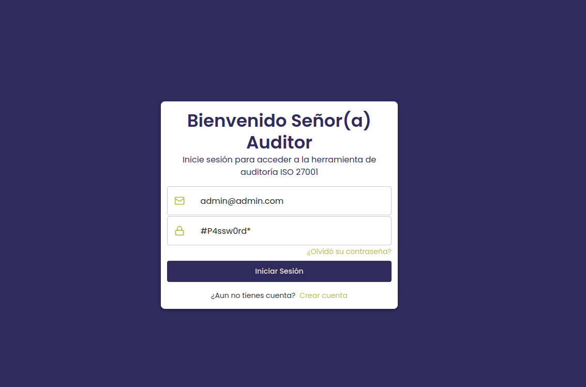
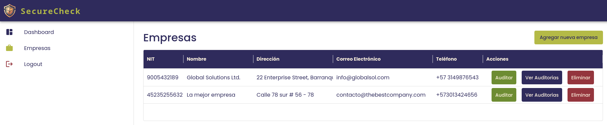
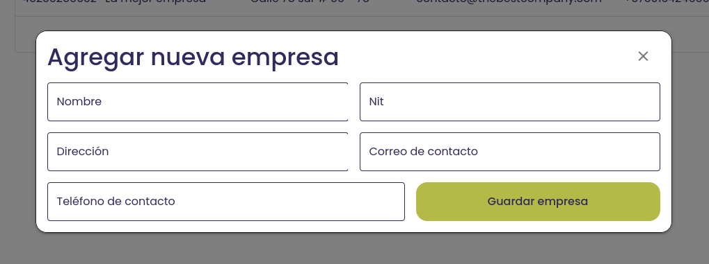
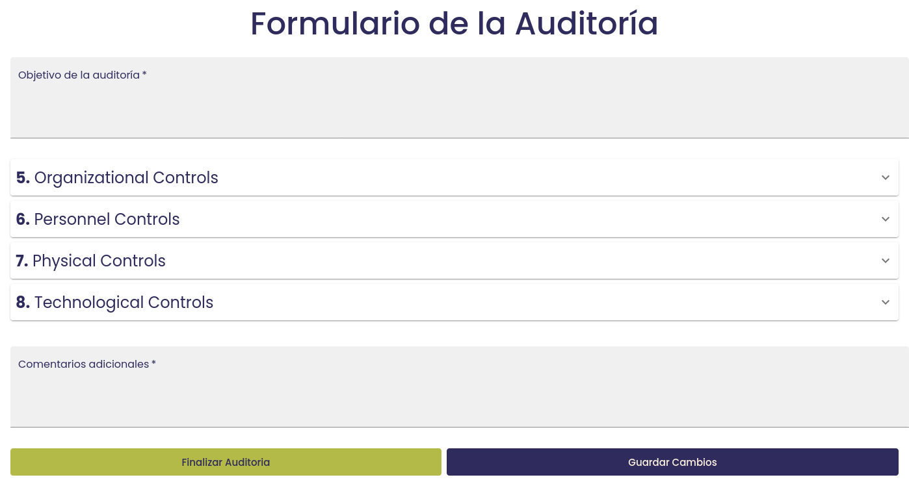
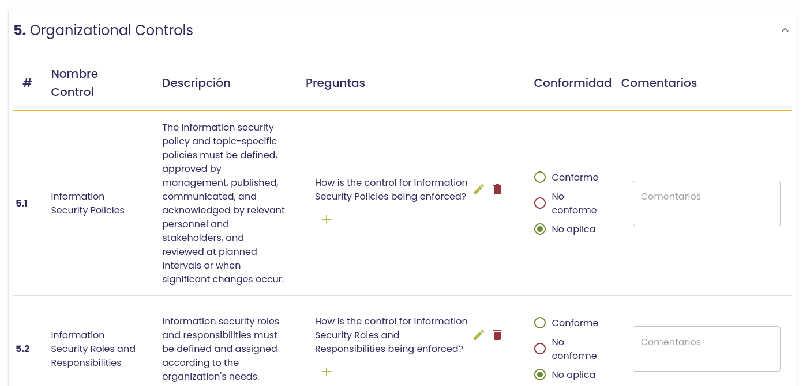
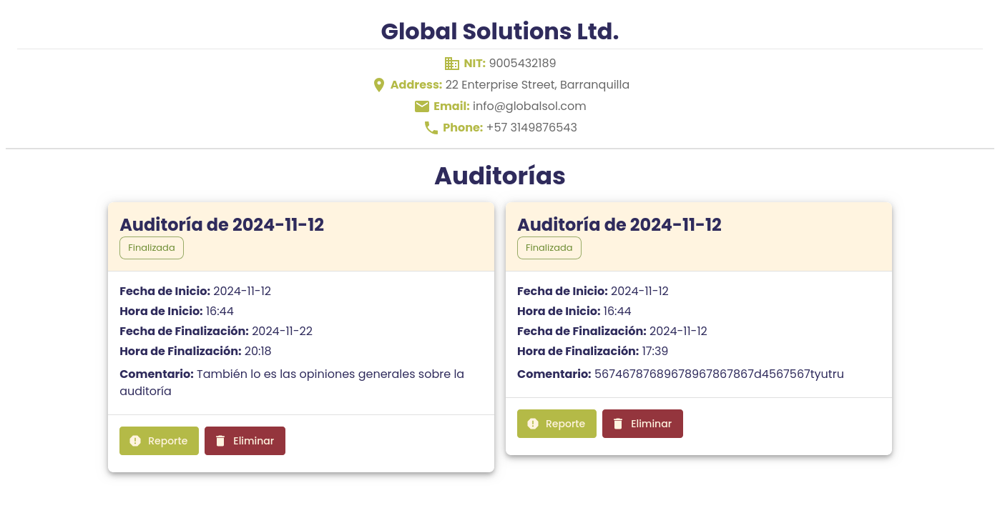
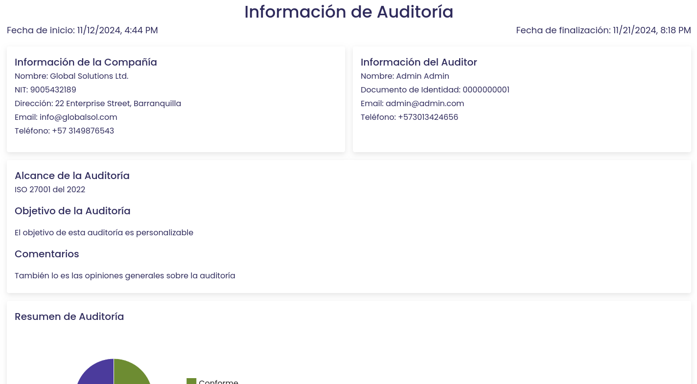

# Manual de usuario

1. Esta aplicación tiene un usuario de ejemplo con el que puedes iniciar sesión:

    
2. Una vez adentro, si le das en la barra lateral a la opicón de Empresas te saldrá la siguiente tabla:
    
    En esta sección puedes hacer varias cosas: 
    - agregar nuevas empresas, presionando el botón de *Agregar Nueva Empresa*, lo cual abrirá el siguiente modal:
        
    - Auditarlas
    - Ver las auditorías ya hechas de una empresa (los reportes).
    - Eliminar las empresas.
3. Al darle *Auditar* a una empresa te dirigirá a la siguiente ventana:
    
    En esta ventana podrás hacer todo lo referente a la auditoría de la empresa, es decir, agregar preguntas, eliminarlas, decir si un control es conforme o no conforme y dejar el comentario explicando el porqué de esto.
    
4. Al darle *Ver auditorías* la página te dirigirá a una sección donde estará el resumen de todas las auditorías de las empresa
    
    Aquí podras ver el reporte de esta auditoría o eliminarla.
5. Si en la sección anterior le diste a *Reporte* te saldrá el reporte completo para esa auditoría en especifíco:
    
    
